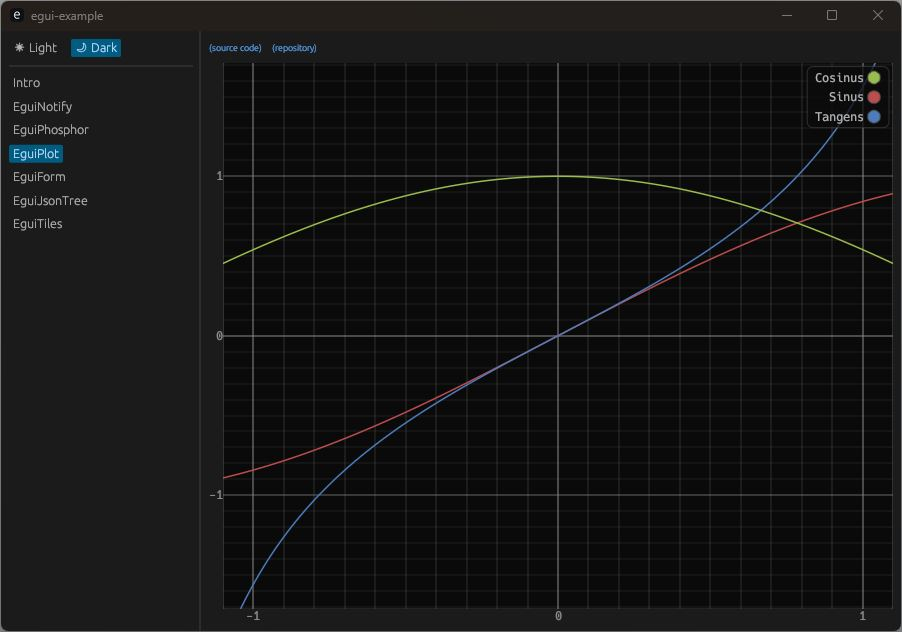

# egui-example

This repository includes examples for some crates for egui.

## Examples

- [egui-notify](https://github.com/ItsEthra/egui-notify)
- [egui-phosphor](https://github.com/amPerl/egui-phosphor)
- [egui-plot](https://github.com/emilk/egui_plot)
- [egui_form](https://github.com/lucasmerlin/hello_egui/tree/main/crates/egui_form)
- [egui_json_tree](https://github.com/dmackdev/egui_json_tree)
- [egui_tiles](https://github.com/rerun-io/egui_tiles)
- [egui-file-dialog](https://github.com/fluxxcode/egui-file-dialog)
